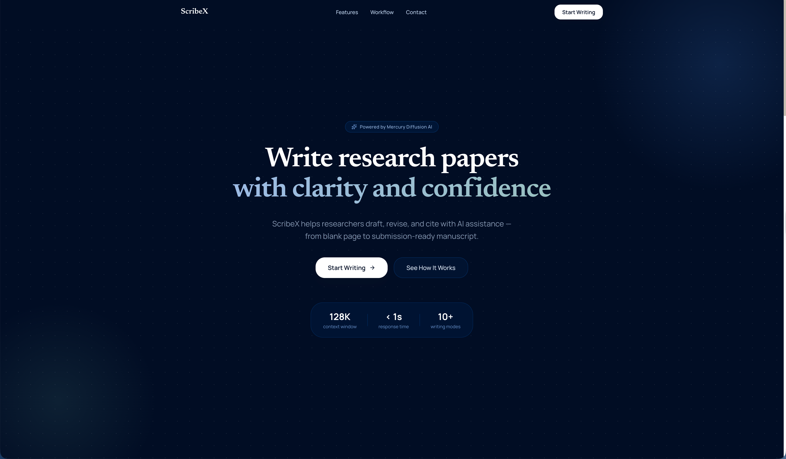
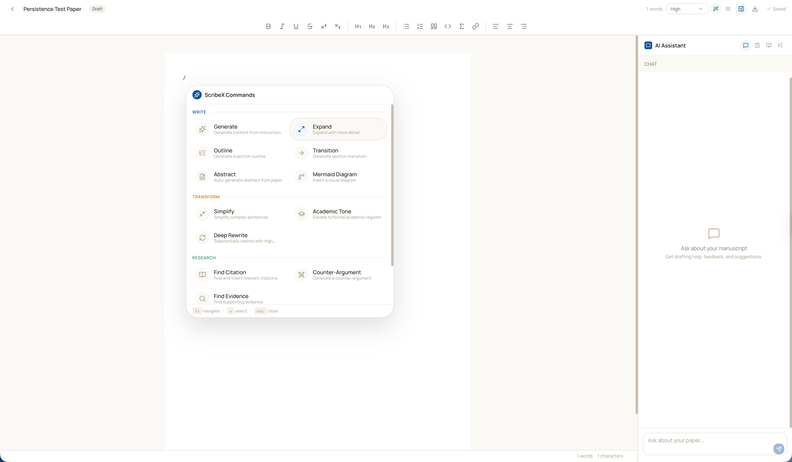
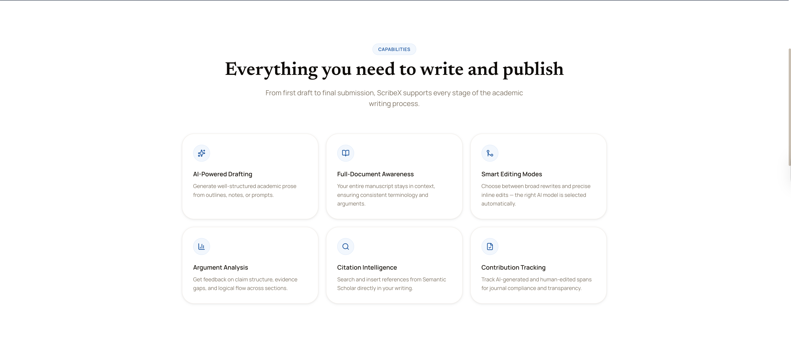

<p align="center">
  
</p>

<p align="center">
  <strong>AI-powered academic writing workspace built on Mercury diffusion models</strong>
</p>

<p align="center">
  <a href="https://nextjs.org"></a>
  <a href="https://react.dev"></a>
  <a href="https://www.typescriptlang.org"></a>
  <a href="https://tailwindcss.com"></a>
  <a href="https://tiptap.dev"></a>
  <a href="https://opensource.org/licenses/MIT"></a>
  <a href="https://scribex-tuel-ai.vercel.app"></a>
</p>

<p align="center">
  <a href="https://scribex-tuel-ai.vercel.app"><strong>Live Demo</strong></a> · <a href="#quick-start">Quick Start</a> · <a href="#feature-status">Features</a> · <a href="docs/architecture.md">Architecture</a>
</p>

---

ScribeX combines a manuscript editor, writing-mode automation, citation search, multi-format export, humanizer pipeline, AI detection, and structured review workflows into one focused tool for researchers who need to move from rough draft to submission-ready writing with less friction.

## Why This Tool Exists

Academic writing is usually split across multiple tools — one for drafting, another for references, another for revision, and yet another for AI prompting. ScribeX pulls those loops into a single interface:

- **Draft and revise** inside a TipTap editor with slash-command AI actions
- **15 writing commands** — generate, expand, simplify, academic tone, outline, counter-argument, evidence, transitions, abstract, rewrite, diffusion draft, mermaid diagrams, summarize, continue, and more
- **Floating AI actions** on text selection — 10 quick actions + 7-mode ribbon panel for rewrite, stylize, fix, custom, tone, humanize, and detect
- **Writing tools suite** — synonyms (5 variants), stylize (8 styles), fix (copy editor), custom instructions, tone analysis
- **Humanize AI text** with few-shot learning pipeline (456-entry dataset, 3-tier UX)
- **AI detection** with sentence-level scoring and color-coded breakdown
- **Citation search** via Semantic Scholar with 6 citation style formats (APA-7, MLA-9, Chicago-17, IEEE, Harvard, Vancouver)
- **Structured manuscript review** with scored category feedback via JSON schema output
- **Export to 6 formats** — PDF, Word (DOCX), Markdown, HTML, BibTeX, and LaTeX
- **Dark mode** with full oklch color scale inversion across all 3 design scales
- **Local-first persistence** with content-hash autosave, per-paper chat, auto-naming, and localStorage hydration
- **Diffusion drafting** — visualize Mercury's parallel denoising process as your draft takes shape

## Screenshots

|              Hero               |             Editor Commands             |                  Capabilities                  |
| :-----------------------------: | :-------------------------------------: | :--------------------------------------------: |
|  |  |  |

## Quick Start

### Prerequisites

- [Node.js](https://nodejs.org/) 20+
- [pnpm](https://pnpm.io/) 9+
- An [Inception Labs](https://www.inceptionlabs.ai/) API key for Mercury

### Setup

```bash
git clone https://github.com/omerakben/ScribeX.git
cd ScribeX
pnpm install
cp .env.example .env.local
```

Edit `.env.local` with your API key:

```env
INCEPTION_API_KEY=your_inception_api_key_here   # Required
SEMANTIC_SCHOLAR_API_KEY=                        # Optional — increases rate limits
NEXT_PUBLIC_APP_URL=http://localhost:3000        # Use your Vercel URL in production
NEXT_PUBLIC_JOIN_CODE=                           # Leave empty to bypass access gate
```

```bash
pnpm dev
```

Open [http://localhost:3000](http://localhost:3000).

## Tech Stack

| Layer      | Technology                                              |
| ---------- | ------------------------------------------------------- |
| Framework  | Next.js 16 (App Router)                                 |
| Editor     | TipTap v3 + ProseMirror                                 |
| AI Models  | Mercury 2 (reasoning) + Mercury Edit (FIM/apply)        |
| State      | Zustand 5 with localStorage persistence                 |
| Styling    | Tailwind CSS v4, shadcn/ui, Radix primitives            |
| Citations  | Semantic Scholar API                                    |
| Export     | html2pdf.js, docx, turndown, marked                     |
| Animations | Framer Motion + CSS keyframes                           |
| E2E Tests  | Playwright                                              |
| Fonts      | Manrope (UI), Newsreader (editor), IBM Plex Mono (code) |

## Architecture

```
User ─→ EditorCanvas / AIPanel / FloatingMenu
              │
              ├─→ Mercury Client (src/lib/mercury/client.ts)
              │         │
              │         └─→ POST /api/mercury ──→ Inception Labs API
              │              (chat / apply / fim / edit)
              │
              ├─→ POST /api/humanize ──→ Mercury-2 (few-shot humanization)
              │
              ├─→ POST /api/detect ──→ Heuristic AI detection
              │
              ├─→ GET /api/citations ──→ Semantic Scholar API
              │
              └─→ Zustand Stores ←──→ localStorage
                   (scribex:editor / scribex:dashboard)
```

- **Browser never calls Inception directly** — all AI requests proxy through `/api/mercury` which attaches the server-side `INCEPTION_API_KEY`
- **Middleware** (`src/middleware.ts`) applies CSRF protection and rate limiting (60 req/min per IP) to all `/api/*` routes
- **Mercury Client** routes writing modes to the correct model: `mercury-2` for generative work, `mercury-edit` for autocomplete/FIM and short edits
- **Temperature engineering** — 22-action temperature map across 5 tiers (0.0 deterministic to 0.9 high creativity) with dynamic token caps based on input length

## Feature Status

| Feature                                             | Status |
| --------------------------------------------------- | ------ |
| Mercury streaming + reasoning controls              | Done   |
| Diffusion drafting with denoising overlay           | Done   |
| Quick edit / deep rewrite modes                     | Done   |
| FIM ghost text with word-by-word acceptance         | Done   |
| Multi-alternative ghost text (5 cached, Arrow cycle)| Done   |
| Structured manuscript review (JSON schema)          | Done   |
| Citation search + style-aware insertion             | Done   |
| 15 slash commands with model routing                | Done   |
| 7 paper templates (IMRAD, lit review, thesis, etc.) | Done   |
| Floating menu (10 AI actions) + ribbon panel        | Done   |
| Writing tools: synonyms, stylize, fix, custom, tone | Done   |
| Humanizer pipeline (few-shot, 456-entry dataset)    | Done   |
| AI detection with sentence-level breakdown          | Done   |
| Change block parser + diff cards in AI chat         | Done   |
| Document stats + readability badge (Flesch score)   | Done   |
| Content-hash autosave + auto-naming                 | Done   |
| Per-paper chat histories + prompt history (50)      | Done   |
| Dark mode (full oklch color scale inversion)        | Done   |
| Keyboard shortcuts (5 AI bindings)                  | Done   |
| Temperature engineering (22-action map, 5 tiers)    | Done   |
| HTML sanitization pipeline (5-stage)                | Done   |
| Local persistence + autosave                        | Done   |
| Export: PDF, DOCX, Markdown, HTML, BibTeX, LaTeX    | Done   |
| Math (KaTeX) + Mermaid diagram support              | Done   |
| Superscript / Subscript                             | Done   |
| CSRF protection + rate limiting middleware          | Done   |
| E2E test suite (10 Playwright specs)                | Done   |
| Join-code access gate                               | Done   |

### Known Constraints

- Persistence is browser localStorage only — no server-backed database
- Access gating uses a client-side join code, not full authentication
- AI detection uses heuristic analysis — production swap to Pangram/GPTZero planned
- Plan/usage tier constants exist in code but are not enforced server-side
- Rate limiting is in-memory (not suitable for multi-region deployment without Redis)

## Usage Examples

### Stream a Mercury chat completion

```ts
import { streamChatCompletion } from "@/lib/mercury/client";

let output = "";

await streamChatCompletion(
  [{ role: "user", content: "Draft a concise IMRAD introduction on retrieval-augmented generation." }],
  {
    reasoningEffort: "high",
    diffusing: false,
    onChunk: (chunk) => { output += chunk; },
    onDone: () => console.log("done", output),
    onError: (error) => console.error(error),
  }
);
```

### Request structured review output

```ts
import { structuredChatCompletion } from "@/lib/mercury/client";
import { REVIEW_JSON_SCHEMA } from "@/lib/constants";

const review = await structuredChatCompletion<{
  categories: { label: string; score: number; feedback: string }[];
}>(
  [{ role: "user", content: "Review this manuscript for argument quality and methodological clarity." }],
  REVIEW_JSON_SCHEMA,
  { reasoningEffort: "medium" }
);
```

### Apply targeted edit

```ts
import { applyEdit } from "@/lib/mercury/client";

const revised = await applyEdit(
  "This paragraph has dense and repetitive phrasing.",
  "Simplify while preserving academic tone and factual meaning."
);
```

### FIM autocomplete

```ts
import { fimCompletion } from "@/lib/mercury/client";

const suggestion = await fimCompletion(
  "The results demonstrate that",
  "under strict latency budgets."
);
```

### Humanize AI-generated text

```ts
import { humanizeText } from "@/lib/mercury/client";

const { alternatives } = await humanizeText(
  "AI-generated text here",
  { count: 4 }
);
```

### Detect AI-written content

```ts
import { detectAI } from "@/lib/detection/client";

const { score, label, sentences } = await detectAI(
  "Text to analyze for AI patterns."
);
// label: "human" | "mixed" | "ai"
// sentences: per-sentence scores with color thresholds
```

## Keyboard Shortcuts

| Shortcut | Action |
| -------- | ------ |
| `Cmd/Ctrl+Shift+R` | Rewrite selection |
| `Cmd/Ctrl+Shift+H` | Humanize selection |
| `Cmd/Ctrl+Shift+F` | Fix grammar |
| `Cmd/Ctrl+Shift+Y` | Stylize selection |
| `Cmd/Ctrl+Shift+D` | Detect AI |
| `Tab` | Accept next ghost text word |
| `Cmd/Ctrl+Enter` | Accept all ghost text |
| `Arrow Up/Down` | Cycle ghost text alternatives |

## API Routes

### `POST /api/mercury`

Server-side proxy to Inception API (`https://api.inceptionlabs.ai/v1`). API keys never reach the browser.

```json
{
  "endpoint": "chat | apply | fim | edit",
  "model": "mercury-2 | mercury-edit",
  "...payload": "endpoint-specific fields"
}
```

Endpoint mapping: `chat` → `/chat/completions`, `apply` → `/apply/completions`, `fim` → `/fim/completions`, `edit` → `/edit/completions`

### `POST /api/humanize`

Few-shot humanization pipeline. Assembles examples from a 456-entry dataset server-side, calls Mercury-2.

```json
{
  "text": "AI-generated text to humanize",
  "context": "optional surrounding context",
  "count": 4,
  "action": "generate | generate_one",
  "existing": ["previously generated alternatives for dedup"],
  "temperature": 0.9
}
```

Returns `{ alternatives: string[] }` for `generate` or `{ alternative: string }` for `generate_one`.

### `POST /api/detect`

Heuristic AI detection with per-sentence scoring.

```json
{ "text": "Text to analyze (10 chars min, 20K max)" }
```

Returns `{ score: number, label: "human" | "mixed" | "ai", sentences: [{ text, score }] }`.

### `GET /api/citations`

Queries Semantic Scholar and normalizes results into ScribeX citation format.

| Param    | Required | Default |
| -------- | -------- | ------- |
| `q`      | Yes      | —       |
| `limit`  | No       | `10`    |
| `offset` | No       | `0`     |

## Export Formats

| Format   | Engine      | Notes                                                                                      |
| -------- | ----------- | ------------------------------------------------------------------------------------------ |
| PDF      | html2pdf.js | Inline CSS with hex colors (oklch incompatible with html2canvas); renders in hidden iframe |
| DOCX     | docx        | Full DOM-to-docx with math (Cambria Math), tables, lists, TOC, header/footer               |
| Markdown | turndown    | Custom rules for math, mermaid, super/subscript, GFM tables                                |
| HTML     | Custom      | Standalone document with embedded CSS, Google Fonts, KaTeX CDN, print media queries        |
| BibTeX   | Custom      | Entry type detection, author formatting, double-braced titles                              |
| LaTeX    | Custom      | HTML-to-LaTeX via DOMParser; 12-package preamble; math passthrough                         |

## Development

```bash
pnpm dev          # Start dev server
pnpm build        # Production build
pnpm lint         # ESLint
npx tsc --noEmit  # Type-check
```

### E2E Tests

```bash
# Start dev server first, then in another terminal:
npx playwright test                           # All specs
npx playwright test e2e/04-editor-core.spec.ts  # Single spec
npx playwright test --headed                  # With visible browser
npx playwright show-report e2e/report         # View report
```

10 spec files covering: landing page, auth gate, dashboard, editor core, slash commands, AI features, citations, autocomplete, persistence, and editor extensions.

## Project Structure

```
src/
├── app/                    # Next.js App Router
│   ├── api/mercury/        # Mercury API proxy route
│   ├── api/citations/      # Semantic Scholar proxy route
│   ├── api/humanize/       # Humanizer pipeline route
│   ├── api/detect/         # AI detection route
│   ├── dashboard/          # Paper management pages
│   └── editor/[id]/        # Editor (dynamic route)
├── components/
│   ├── editor/             # TipTap editor, AI panel, toolbar, slash menu,
│   │                       #   floating-menu, floating-ribbon, change-diff-card,
│   │                       #   dark-mode-toggle, document-stats, readability-badge,
│   │                       #   tone-analysis-card, humanizer-panel, ai-detection-badge
│   ├── dashboard/          # Sidebar, paper cards, new-paper dialog
│   ├── export/             # Export format dialog
│   ├── landing/            # Marketing page sections
│   ├── shared/             # JoinGate, ToasterProvider, DarkModeProvider
│   └── ui/                 # shadcn/ui primitives (barrel export)
├── data/                   # humanizer-dataset.json (456 entries, server-only)
├── hooks/                  # useHydration
├── lib/
│   ├── constants/          # System prompts, commands, templates, temperatures (22-action map)
│   ├── detection/          # AI detection: heuristics, client
│   ├── export/             # 6 format handlers + sanitizer + utils
│   ├── extensions/         # ghost-text (multi-alt), mermaid-block,
│   │                       #   floating-menu-plugin, keyboard-shortcuts
│   ├── humanizer/          # Dataset loader, pipeline, types
│   ├── mercury/            # Mercury API client wrapper
│   ├── prompts/            # 37 prompt files: commands/, synonyms/, stylize/,
│   │                       #   fix/, custom/, humanize/, assistant/, document/, system/
│   ├── storage/            # localStorage helpers (SSR-safe)
│   ├── store/              # Zustand stores (editor + dashboard)
│   ├── types/              # TypeScript types
│   └── utils/              # cn, markdown-to-html, change-block-parser,
│                           #   readability, content-hash, sanitize-html,
│                           #   selection-markers, context-window
├── middleware.ts            # CSRF + rate limiting for /api/*
└── types/                  # Module declarations (html2pdf.js)
```

## Why Mercury and Diffusion Matter

ScribeX wraps [Inception Labs'](https://www.inceptionlabs.ai/) Mercury model family using their OpenAI-compatible API surface.

Based on Inception's official materials:

- Mercury 2 is a diffusion-based reasoning model focused on high-speed production inference
- The [Mercury 2 launch post](https://www.inceptionlabs.ai/blog/introducing-mercury-2) describes parallel refinement (instead of sequential token decoding), highlighting latency-oriented usage for coding, agentic pipelines, and real-time interaction
- Inception's [platform docs](https://docs.inceptionlabs.ai/get-started/get-started) describe OpenAI-compatible endpoints, 128K chat context, reasoning effort controls, structured outputs, and editing endpoints (`fim`, `apply`, `edit`)

ScribeX's value is the workflow layer on top: editor-native controls, writing-mode routing, diffusion UI, review schema integration, and citation-aware UX.

## Acknowledgements

- **[Inception Labs](https://www.inceptionlabs.ai/)** — Mercury and Mercury 2 models, API platform
  - [Introducing Mercury 2](https://www.inceptionlabs.ai/blog/introducing-mercury-2)
  - [Platform docs](https://docs.inceptionlabs.ai/get-started/get-started)
  - [Models & pricing](https://docs.inceptionlabs.ai/get-started/models)
- **[TUEL AI](https://tuel.ai/)** — Project context and publication track
- Built by **[Omer Akben](https://omerakben.com/)** — [GitHub](https://github.com/omerakben/ScribeX) · [Live Demo](https://scribex-tuel-ai.vercel.app)

## License

[MIT](LICENSE)
