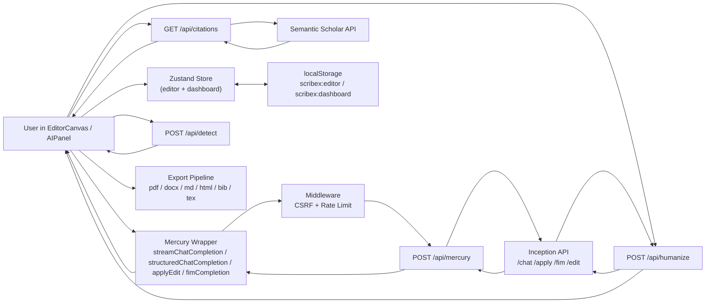

# ScribeX Architecture

Last verified: **March 1, 2026**.

This document describes the runtime architecture implemented in the current ScribeX codebase.

## 1. System Components

- **App shell and routes**: Next.js App Router (`src/app/*`)
- **Editor runtime**: TipTap-based editor and writing flows (`src/components/editor/*`)
- **State layer**: Zustand stores with persist middleware (`src/lib/store/editor-store.ts`)
- **Mercury wrapper**: client-side request adapters (`src/lib/mercury/client.ts`)
- **Mercury proxy route**: server-side endpoint fanout (`src/app/api/mercury/route.ts`)
- **Citation route**: Semantic Scholar integration (`src/app/api/citations/route.ts`)
- **Middleware**: CSRF protection and rate limiting (`src/proxy.ts`)
- **Export pipeline**: 6-format document export system (`src/lib/export/*`)
- **Custom extensions**: Ghost text autocomplete, Mermaid diagrams, keyboard shortcuts (`src/lib/extensions/*`)
- **Prompt system**: 37 TypeScript prompt files with loader and router (`src/lib/prompts/`)
- **Humanizer module**: Few-shot pipeline with 456-entry dataset (`src/lib/humanizer/`)
- **AI detection**: Heuristic text analysis (`src/lib/detection/`)
- **Floating menu system**: Selection-triggered AI actions with self-contained positioning (`src/components/editor/floating-menu.tsx`, `floating-ribbon.tsx`)
- **Temperature engineering**: 22-action temperature map across 5 tiers (`src/lib/constants/temperatures.ts`)

## 2. End-to-End Data Flow

## 3. Core UI Flows

### 3.1 Writing and AI generation

1. User triggers action from slash command menu, AI panel, or floating menu.
2. `EditorCanvas`/`AIPanel` calls Mercury wrapper functions.
3. Wrapper posts to `POST /api/mercury` with endpoint selector.
4. Middleware validates origin (CSRF) and checks rate limit (60 req/min per IP).
5. API route maps endpoint and forwards request with server-side `INCEPTION_API_KEY`.
6. Streamed or non-stream response updates editor content and AI panel state.

### 3.2 Diffusion drafting flow

- Diffusion mode is toggled in toolbar or command-based via `diffuse` action.
- `streamChatCompletion(..., { diffusing: true })` processes SSE chunks.
- In diffusion mode, `delta.content` is treated as full denoised text state per step.
- `DiffusionOverlay` visualizes denoising progression via `diffusionStep` and `diffusionContent`.

### 3.3 Citation flow

1. Citation search UI calls `GET /api/citations?q=...`.
2. Route queries Semantic Scholar and normalizes into internal `Citation` shape.
3. User inserts citation marker into editor (numeric or author-date style aware).
4. Citation is upserted into current paper references.

### 3.4 Export flow

1. User opens export dialog from toolbar, selects format and options (include references, include TOC).
2. `exportPaper()` dispatches to format-specific handler in `src/lib/export/`.
3. Handler converts TipTap HTML content to target format (see table below).
4. Result is downloaded via `file-saver` using `downloadText()` or `downloadBlob()`.

| Format | Handler | Engine |
|--------|---------|--------|
| PDF | `pdf.ts` | html2pdf.js via hidden iframe, hex colors for html2canvas compatibility |
| DOCX | `docx.ts` | `docx` library with DOM traversal, math/table/list support, header/footer/TOC |
| Markdown | `markdown.ts` | `turndown` with custom rules for math, mermaid, super/subscript, GFM tables |
| HTML | `html.ts` | Standalone document with embedded CSS, Google Fonts, KaTeX CDN |
| BibTeX | `bibtex.ts` | Entry type detection, author formatting, double-braced titles |
| LaTeX | `latex.ts` | HTML-to-LaTeX via DOMParser, 12-package preamble, math passthrough |

All HTML content is sanitized via `src/lib/utils/sanitize-html.ts` before export (5-stage pipeline: script/style removal, dangerous block removal, tag allowlist filtering, event handler stripping, attribute sanitization).

### 3.5 Floating menu flow

1. User selects text in the editor.
2. `floating-menu.tsx` detects selection via TipTap `selectionUpdate` event (300ms debounce).
3. A sparkle trigger icon appears near the selection.
4. Clicking the trigger fans out 10 action buttons (Rewrite, Simplify, Academic, Expand, Stylize, Humanize, Fix, Detect, Custom, Tone) with spring animations.
5. Simple actions (Rewrite, Simplify, Academic, Expand) apply directly via `applyEdit()` or `streamChatCompletion()`.
6. Complex actions (Stylize, Humanize, Fix, Detect, Custom, Tone) open the floating ribbon panel with mode-specific UI.
7. Ribbon results are applied back to the editor via ProseMirror transactions.

### 3.6 Humanizer flow

1. User selects text and clicks Humanize in the floating menu.
2. Floating ribbon opens in humanize mode, rendering `HumanizerPanel`.
3. Panel calls `POST /api/humanize` with `action: "generate"`, which assembles 5 few-shot examples from the 456-entry dataset server-side and calls Mercury-2.
4. Four alternative humanized versions are displayed with stagger animation.
5. "Generate More" button calls `POST /api/humanize` with `action: "generate_one"` and existing alternatives for dedup. Temperature ramps +0.15 per existing variant (capped at 1.5).
6. Clicking a card applies the text to the editor and closes the panel.

### 3.7 AI detection flow

1. User selects text and clicks Detect in the floating menu.
2. Floating ribbon opens in detect mode, rendering `AIDetectionBadge`.
3. Badge calls `POST /api/detect` with the selected text.
4. Heuristic analyzer scores the text using type-token ratio, passive voice frequency, transition word density, and sentence-length burstiness.
5. Badge displays color-coded result: green (<30%, human), amber (30-60%, mixed), red (>60%, AI).
6. Expandable view shows per-sentence breakdown with individual scores.

## 4. Persistence and Hydration

State persistence is local-first:

- Persist keys:
  - `scribex:editor`
  - `scribex:dashboard`
- Persisted editor subset includes:
  - `papers`
  - `autocompleteEnabled`
  - `diffusionEnabled`
  - `reasoningEffort`
  - `promptHistory`
  - `darkMode`
  - `chatHistories`
- Persisted dashboard subset includes:
  - `selectedTemplate`
  - `selectedCitationStyle`
- Transient editor fields (not persisted):
  - `contentHashes` (per-paper djb2 hash map)
  - `promptHistoryIndex`
  - `autoNamedPapers`

Hydration behavior:

- Both stores use `skipHydration: true` to avoid SSR mismatches.
- `useHydration()` triggers `persist.rehydrate()` for both stores using `useSyncExternalStore`.
- Dashboard layout renders a spinner until hydration completes.

Autosave behavior:

- Autosave interval constant: `AUTOSAVE_INTERVAL_MS = 30_000`.
- Content hash autosave: `djb2Hash()` fingerprints each paper's content. `hasContentChanged()` compares current hash against `contentHashes` map — no-op saves are skipped when content is unchanged.
- Save triggers:
  - periodic interval
  - `Cmd/Ctrl+S`
  - `beforeunload`
  - `visibilitychange` to `hidden`
  - editor unmount

Auto-naming behavior:

- `autoNamePaper(id)` fires asynchronously when content exceeds 50 characters and the title is still "Untitled Paper".
- Uses `structuredChatCompletion` with the `generate-name` prompt to produce a title via `{"name": "..."}` JSON schema.
- `autoNamedPapers` set (transient) prevents duplicate naming requests for the same paper.

Per-paper chat:

- `chatHistories: Record<string, AIMessage[]>` stores messages keyed by paper ID.
- `getCurrentMessages()` getter returns messages for the active paper.
- `pruneOrphanedChatHistories()` cleans up histories when papers are deleted.

Prompt history:

- Last 50 prompts are persisted in `promptHistory`.
- Arrow Up/Down navigation in the AI panel input with draft preservation via `draftRef`.

## 5. Security Boundaries

### 5.1 Proxy Middleware (`src/proxy.ts`)

Applied to all `/api/*` routes via `config.matcher`:

- **CSRF protection**: Compares `Origin` header against `NEXT_PUBLIC_APP_URL`. Cross-origin requests return 403.
- **Rate limiting**: In-memory sliding window, 60 requests/minute per IP (from `x-forwarded-for`). Returns 429 on exceed. Map pruned at 10,000 entries.
- **Note**: Rate limiting is in-memory and not multi-region safe. Use Upstash Redis for production multi-instance deployments.

### 5.2 Mercury key handling

- Browser code never calls Inception directly.
- Browser calls only local route `POST /api/mercury`.
- `INCEPTION_API_KEY` is read server-side from environment in route handler.

### 5.3 Citation API handling

- Semantic Scholar key is optional.
- If present, route sets `x-api-key` server-side.
- If absent, route still works with unauthenticated request behavior and default rate limits.

### 5.4 HTML sanitization

- `src/lib/utils/sanitize-html.ts` provides a 5-stage pipeline applied in `markdown-to-html.ts` and before export: script/style removal, dangerous block removal, tag allowlist filtering, event handler stripping, and attribute sanitization. SSR-compatible.

### 5.5 API route authentication

- `src/lib/utils/api-auth.ts` provides `validateJoinCode()` — shared join-code validation used by all 4 API routes. Uses constant-time comparison (`crypto.timingSafeEqual`) to prevent timing side-channel attacks.

## 6. Custom TipTap Extensions

### Ghost Text (`src/lib/extensions/ghost-text.ts`)

- ProseMirror plugin for FIM autocomplete suggestions.
- Debounces 300ms (`AUTOCOMPLETE_DELAY_MS`) after document changes.
- Calls `fimCompletion(prefix, suffix)` with max 2000 char prefix / 500 char suffix.
- Renders suggestion as `.ghost-text` decoration widget at cursor.
- **Word-by-word acceptance**: Tab accepts the next word only, Cmd/Ctrl+Enter accepts all remaining text. Progressive slicing of ghost text string.
- **Multi-alternative caching**: Up to 5 FIM alternatives cached per cursor position. Arrow Up/Down cycles through cached alternatives. Temperature ramp: 0.0, 0.1, 0.2, 0.3, 0.4 per alternative. Background pre-fetch of alternative[1] after first suggestion arrives.
- **Jaccard similarity dedup**: Threshold of 0.8 prevents near-duplicate alternatives from being cached.
- **Visual badge**: Shows current position indicator (e.g. "1/3") when multiple alternatives are available.
- **Smart spacing**: `normalizeSpacing()` prevents double spaces, auto-prepends space when cursor follows a word character, and collapses internal doubles. Applied in both word-by-word and full acceptance paths.
- Escape dismisses the current suggestion.
- Uses `AbortController` for in-flight request cancellation.
- Minimum 20 chars of prefix before triggering.

### Mermaid Block (`src/lib/extensions/mermaid-block.tsx`)

- Atom TipTap node with React NodeView.
- Toggle between edit (textarea) and render (SVG) modes.
- Dynamic `import("mermaid")` with `theme: "neutral"`, `securityLevel: "strict"`.
- Parsed from `div[data-type="mermaid-block"]`.

### Keyboard Shortcuts (`src/lib/extensions/keyboard-shortcuts.ts`)

- TipTap Extension with 5 AI action bindings:
  - `Cmd/Ctrl+Shift+R` — Rewrite selection
  - `Cmd/Ctrl+Shift+H` — Humanize selection
  - `Cmd/Ctrl+Shift+F` — Fix grammar
  - `Cmd/Ctrl+Shift+Y` — Stylize selection
  - `Cmd/Ctrl+Shift+D` — Detect AI
- Dispatches `CustomEvent('scribex:shortcut', { detail: { action } })` for decoupled communication with the floating menu.

## 7. Dark Mode

Tailwind v4 `.dark` class strategy:

- `src/app/globals.css` defines a `.dark` block that overrides all CSS custom properties. The `ink-*`, `brand-*`, and `mercury-*` oklch color scales are inverted for dark backgrounds. Surface tokens, shadow values, and semantic colors are all remapped.
- `src/components/shared/dark-mode-provider.tsx` is a client component that reads `darkMode` from Zustand and applies the `.dark` class on `<html>`. Mounted in `layout.tsx`.
- `src/components/editor/dark-mode-toggle.tsx` provides a Moon/Sun icon toggle in the editor toolbar.
- Tailwind v4 `var()` utilities resolve automatically against the overridden custom properties, so components do not need conditional dark-mode classes.

## 8. E2E Test Coverage

10 Playwright spec files in `e2e/`:

| Spec | Coverage |
|------|----------|
| `01-landing` | Hero, navbar, features, pricing, footer, scroll behavior |
| `02-auth-gate` | JoinGate access control |
| `03-dashboard` | Dashboard rendering, paper management |
| `04-editor-core` | Toolbar, keyboard shortcuts, word count, dirty state, export, AI panel, math, title |
| `05-slash-commands` | Slash command menu trigger and commands |
| `06-ai-features` | AI panel modes and streaming |
| `07-citations` | Citation search UI |
| `08-autocomplete` | Ghost text behavior |
| `09-persistence` | localStorage persistence and autosave |
| `10-editor-extensions` | Math/KaTeX, Mermaid, extensions |

Test helpers (`e2e/helpers.ts`) use `page.addInitScript` to seed localStorage with valid Zustand persist state before page load, bypassing the join-gate.

## 9. Current Architectural Constraints

- Persistence is browser localStorage only (no server database in current implementation).
- Join gate is client-side access gating (`NEXT_PUBLIC_JOIN_CODE`) rather than full auth/authorization.
- Plan/usage limit constants exist in `PLAN_LIMITS` but have no active backend enforcement.
- Rate limiting is in-memory (single-process); not suitable for horizontally scaled deployments without external store.
- AI detection uses heuristic text analysis; no external provider is integrated yet.

## 10. Source References

- `src/components/editor/editor-canvas.tsx`
- `src/components/editor/ai-panel.tsx`
- `src/components/editor/floating-menu.tsx`
- `src/components/editor/floating-ribbon.tsx`
- `src/components/editor/change-diff-card.tsx`
- `src/components/editor/tone-analysis-card.tsx`
- `src/components/editor/document-stats.tsx`
- `src/components/editor/readability-badge.tsx`
- `src/components/editor/dark-mode-toggle.tsx`
- `src/components/editor/ai-detection-badge.tsx`
- `src/components/editor/humanizer-panel.tsx`
- `src/components/export/export-dialog.tsx`
- `src/components/shared/dark-mode-provider.tsx`
- `src/lib/mercury/client.ts`
- `src/lib/export/index.ts`
- `src/lib/prompts/loader.ts`
- `src/lib/prompts/router.ts`
- `src/lib/humanizer/pipeline.ts`
- `src/lib/detection/heuristics.ts`
- `src/lib/constants/temperatures.ts`
- `src/lib/utils/change-block-parser.ts`
- `src/lib/utils/content-hash.ts`
- `src/lib/utils/readability.ts`
- `src/lib/utils/sanitize-html.ts`
- `src/app/api/mercury/route.ts`
- `src/app/api/citations/route.ts`
- `src/app/api/humanize/route.ts`
- `src/app/api/detect/route.ts`
- `src/lib/store/editor-store.ts`
- `src/lib/extensions/ghost-text.ts`
- `src/lib/extensions/mermaid-block.tsx`
- `src/lib/extensions/keyboard-shortcuts.ts`
- `src/lib/utils/api-auth.ts`
- `src/hooks/use-hydration.ts`
- `src/proxy.ts`
