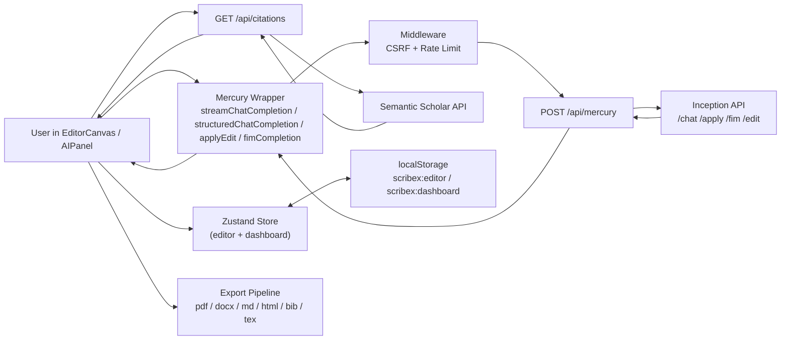

# ScribeX Architecture

Last verified: **February 27, 2026**.

This document describes the runtime architecture implemented in the current ScribeX codebase.

## 1. System Components

- **App shell and routes**: Next.js App Router (`src/app/*`)
- **Editor runtime**: TipTap-based editor and writing flows (`src/components/editor/*`)
- **State layer**: Zustand stores with persist middleware (`src/lib/store/editor-store.ts`)
- **Mercury wrapper**: client-side request adapters (`src/lib/mercury/client.ts`)
- **Mercury proxy route**: server-side endpoint fanout (`src/app/api/mercury/route.ts`)
- **Citation route**: Semantic Scholar integration (`src/app/api/citations/route.ts`)
- **Middleware**: CSRF protection and rate limiting (`src/middleware.ts`)
- **Export pipeline**: 6-format document export system (`src/lib/export/*`)
- **Custom extensions**: Ghost text autocomplete and Mermaid diagrams (`src/lib/extensions/*`)

## 2. End-to-End Data Flow

## 3. Core UI Flows

### 3.1 Writing and AI generation

1. User triggers action from slash command menu or AI panel.
2. `EditorCanvas`/`AIPanel` calls Mercury wrapper functions.
3. Wrapper posts to `POST /api/mercury` with endpoint selector.
4. Middleware validates origin (CSRF) and checks rate limit (60 req/min per IP).
5. API route maps endpoint and forwards request with server-side `INCEPTION_API_KEY`.
6. Streamed or non-stream response updates editor content and AI panel state.

### 3.2 Diffusion drafting flow

- Diffusion mode is toggled in toolbar or command-based via `diffuse` action.
- `streamChatCompletion(..., { diffusing: true })` processes SSE chunks.
- In diffusion mode, `delta.content` is treated as full denoised text state per step.
- `DiffusionOverlay` visualizes denoising progression via `diffusionStep` and `diffusionContent`.

### 3.3 Citation flow

1. Citation search UI calls `GET /api/citations?q=...`.
2. Route queries Semantic Scholar and normalizes into internal `Citation` shape.
3. User inserts citation marker into editor (numeric or author-date style aware).
4. Citation is upserted into current paper references.

### 3.4 Export flow

1. User opens export dialog from toolbar, selects format and options (include references, include TOC).
2. `exportPaper()` dispatches to format-specific handler in `src/lib/export/`.
3. Handler converts TipTap HTML content → target format (see table below).
4. Result is downloaded via `file-saver` using `downloadText()` or `downloadBlob()`.

| Format | Handler | Engine |
|--------|---------|--------|
| PDF | `pdf.ts` | html2pdf.js via hidden iframe, hex colors for html2canvas compatibility |
| DOCX | `docx.ts` | `docx` library with DOM traversal, math/table/list support, header/footer/TOC |
| Markdown | `markdown.ts` | `turndown` with custom rules for math, mermaid, super/subscript, GFM tables |
| HTML | `html.ts` | Standalone document with embedded CSS, Google Fonts, KaTeX CDN |
| BibTeX | `bibtex.ts` | Entry type detection, author formatting, double-braced titles |
| LaTeX | `latex.ts` | HTML-to-LaTeX via DOMParser, 12-package preamble, math passthrough |

All HTML content is sanitized via `sanitize.ts` before export (strips scripts, iframes, event handlers, javascript: URLs).

## 4. Persistence and Hydration

State persistence is local-first:

- Persist keys:
  - `scribex:editor`
  - `scribex:dashboard`
- Persisted editor subset includes:
  - `papers`
  - `autocompleteEnabled`
  - `diffusionEnabled`
  - `reasoningEffort`
- Persisted dashboard subset includes:
  - `selectedTemplate`
  - `selectedCitationStyle`

Hydration behavior:

- Both stores use `skipHydration: true` to avoid SSR mismatches.
- `useHydration()` triggers `persist.rehydrate()` for both stores using `useSyncExternalStore`.
- Dashboard layout renders a spinner until hydration completes.

Autosave behavior:

- Autosave interval constant: `AUTOSAVE_INTERVAL_MS = 30_000`.
- Save triggers:
  - periodic interval
  - `Cmd/Ctrl+S`
  - `beforeunload`
  - `visibilitychange` → `hidden`
  - editor unmount

## 5. Security Boundaries

### 5.1 Middleware (`src/middleware.ts`)

Applied to all `/api/*` routes via `config.matcher`:

- **CSRF protection**: Compares `Origin` header against `NEXT_PUBLIC_APP_URL`. Cross-origin requests return 403.
- **Rate limiting**: In-memory sliding window, 60 requests/minute per IP (from `x-forwarded-for`). Returns 429 on exceed. Map pruned at 10,000 entries.
- **Note**: Rate limiting is in-memory and not multi-region safe. Use Upstash Redis for production multi-instance deployments.

### 5.2 Mercury key handling

- Browser code never calls Inception directly.
- Browser calls only local route `POST /api/mercury`.
- `INCEPTION_API_KEY` is read server-side from environment in route handler.

### 5.3 Citation API handling

- Semantic Scholar key is optional.
- If present, route sets `x-api-key` server-side.
- If absent, route still works with unauthenticated request behavior and default rate limits.

### 5.4 Export sanitization

- `src/lib/export/sanitize.ts` strips `<script>`, `<iframe>`, `<object>/<embed>/<form>`, event handlers, and `javascript:` URLs from content before export.

## 6. Custom TipTap Extensions

### Ghost Text (`src/lib/extensions/ghost-text.ts`)

- ProseMirror plugin for FIM autocomplete suggestions.
- Debounces 300ms (`AUTOCOMPLETE_DELAY_MS`) after document changes.
- Calls `fimCompletion(prefix, suffix)` with max 2000 char prefix / 500 char suffix.
- Renders suggestion as `.ghost-text` decoration widget at cursor.
- Tab accepts (inserts text), Escape dismisses.
- Uses `AbortController` for in-flight request cancellation.
- Minimum 20 chars of prefix before triggering.

### Mermaid Block (`src/lib/extensions/mermaid-block.tsx`)

- Atom TipTap node with React NodeView.
- Toggle between edit (textarea) and render (SVG) modes.
- Dynamic `import("mermaid")` with `theme: "neutral"`, `securityLevel: "strict"`.
- Parsed from `div[data-type="mermaid-block"]`.

## 7. E2E Test Coverage

10 Playwright spec files in `e2e/`:

| Spec | Coverage |
|------|----------|
| `01-landing` | Hero, navbar, features, pricing, footer, scroll behavior |
| `02-auth-gate` | JoinGate access control |
| `03-dashboard` | Dashboard rendering, paper management |
| `04-editor-core` | Toolbar, keyboard shortcuts, word count, dirty state, export, AI panel, math, title |
| `05-slash-commands` | Slash command menu trigger and commands |
| `06-ai-features` | AI panel modes and streaming |
| `07-citations` | Citation search UI |
| `08-autocomplete` | Ghost text behavior |
| `09-persistence` | localStorage persistence and autosave |
| `10-editor-extensions` | Math/KaTeX, Mermaid, extensions |

Test helpers (`e2e/helpers.ts`) use `page.addInitScript` to seed localStorage with valid Zustand persist state before page load, bypassing the join-gate.

## 8. Current Architectural Constraints

- Persistence is browser localStorage only (no server database in current implementation).
- Join gate is client-side access gating (`NEXT_PUBLIC_JOIN_CODE`) rather than full auth/authorization.
- Plan/usage limit constants exist in `PLAN_LIMITS` but have no active backend enforcement.
- Rate limiting is in-memory (single-process); not suitable for horizontally scaled deployments without external store.

## 9. Source References

- `src/components/editor/editor-canvas.tsx`
- `src/components/editor/ai-panel.tsx`
- `src/components/export/export-dialog.tsx`
- `src/lib/mercury/client.ts`
- `src/lib/export/index.ts`
- `src/app/api/mercury/route.ts`
- `src/app/api/citations/route.ts`
- `src/lib/store/editor-store.ts`
- `src/lib/extensions/ghost-text.ts`
- `src/lib/extensions/mermaid-block.tsx`
- `src/hooks/use-hydration.ts`
- `src/middleware.ts`
